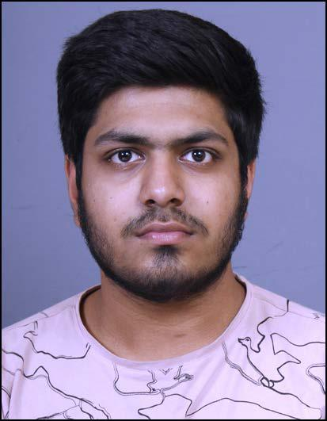

# Aryan Goel

***
       Hi, my name is Aryan Goel. I was born on 01.12.2002 in Bareilly,UP. Now, I am student of IIT GOA one of the most prestigeous college of India. I have many hobbies like playing able table tennis, reading books, doing coding and learning new computer softwares.
***
## Education
|Year of Gradution|Degree|Institute|
|:----:|:----:|:---:|
|2024|B.tech|iit goa|
|2021|12 standard|Vidhya Bhawan Public School|
|2019|10 standard|Vidhya Bhawan Public School|

***
## 1st-year Courses@iit goa
### Autumn Courses
* **CS101**:Introduction to computing by *Client P George*
* **PH101**:Introduction to Relative Motion by *Vaibhav Wasnik*
* **MTH101**:Basic Algebra by *Sandipan De* 
* **HS101**:Humanities by *Shabina Hussain*
### Spring Courses
1. [**CS102**](https://clintpgeorge.github.io/cs-101/autumn-2021/):Introduction to computing by *Client P George*
2. [**MTH102**]():Linear Equation by *Kalpesh Haria*
3. [**PH102**]():Electromagnetism *Santosh Das*
4. [**NO102**]():Sports by *Ashotush sir*
   
***
## Extracircular Activities, Hobbies, Awards

    In the second semester of the B.tech course, there is a very exiciting and ofcourse mandotory course which was taught by Dr.Client P George.

    This course for name as CS102. The course basically taught us about web development, github and GNUi commands. We have learned many new 

    in comand lines like shell scripting, adding a file, removing it, changing the users setting and to know more about the basic terminal.
    We also learn about HTML5 which was used to develop websites and I have created many basics websites after the classes.

